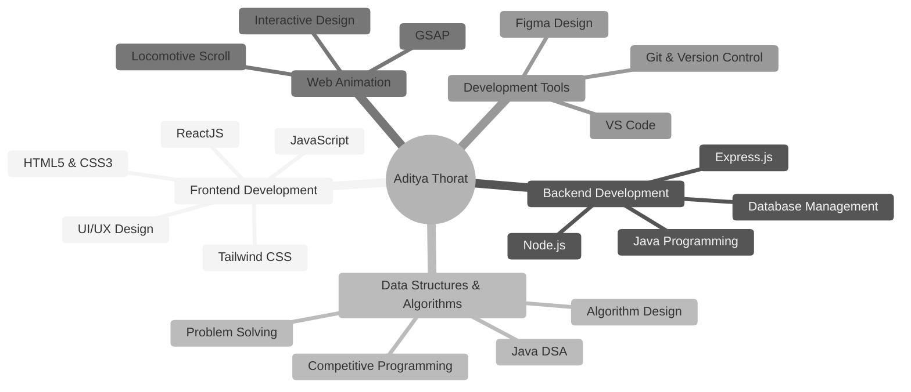

<div align="center">
  
</div>

<p align="center">
  
  
  
</p>

---

## 🚀 About Me

```javascript
const aditya = {
    pronouns: "He/Him",
    location: "India 🇮🇳",
    currentFocus: ["Java & DSA", "Backend Development", "Advanced Animation"],
    askMeAbout: ["Web Development", "Java", "UI/UX Design"],
    technologies: {
        frontEnd: ["ReactJS", "HTML5", "CSS3", "JavaScript", "Tailwind CSS"],
        languages: ["Java", "JavaScript", "C", ""],
        tools: ["Git", "VS Code", "GSAP", "Locomotive Scroll"],
        databases: ["Learning..."],
        currentlyExploring: ["Node.js", "Express.js", "MongoDB"]
    },
    funFact: "I love building things that look great & work smoothly ✨"
};
```

<div align="center">
  
</div>

---

## 🛠️ Tech Stack

<div align="center">
  
</div>

<div align="center">
  
  
  
  
  
  
  
  
  
  
  
  
  
  
</div>


---

## 📊 GitHub Analytics

<div align="center">
  
  
</div>

<div align="center">
  
</div>

## 🏆 GitHub Trophies
<div align="center">
  
</div>

---

## 🎯 Professional Focus Areas

<div align="center">
  


</div>

---

## 🏆 Featured Projects

<div align="center">
  
  [](https://github.com/AdiThorat-eth/Mantra-Comprehensive-Mental-health-Platform)
  [](https://github.com/AdiThorat-eth/Valorant--Reimagined)
  [](https://github.com/AdiThorat-eth/Cloned-a-website---Obys-Agency-)
  
</div>

### 🚀 Project Showcase

| Project | Tech Stack | Status | Description |
|---------|------------|--------|-------------|
| **[Mental Health Support Platform](https://github.com/AdiThorat-eth/Mantra-Comprehensive-Mental-health-Platform)** | `REACTJS` `THREEJS` `TAILWINDCSS` `VITE` `GSAP` `HTML` | 🚀 Deployed | Interactive mental health awareness platform with smooth animations |
| **[Valorant Reimagined](https://github.com/AdiThorat-eth/Valorant--Reimagined)** | `REACTJS` `VITE` `TAILWINDCSS` `GSAP` `HTML` | ✅ Finished | A creative reimagining of the UI/UX for the game Valorant |
| **[Portfolio Website](https://github.com/AdiThorat-eth/portfolio)** | `HTML` `Tailwind CSS` `JavaScript` | 🚧 In Progress | Personal portfolio showcasing projects and skills |
| **[Obys Agency Clone](https://github.com/AdiThorat-eth/Cloned-a-website---Obys-Agency-)** | `HTML` `CSS` `JavaScript` | 🎨 UI Clone | Pixel-perfect recreation of modern agency website |
| **[JavaScript Mastery](https://github.com/AdiThorat-eth/JavaScript)** | `JavaScript` | 📚 Learning | Advanced JS concepts and practical implementations |

---

## 📈 Contribution Graph

<div align="center">
  
</div>

---

## 🌟 What I'm Up To

```yaml
Currently:
  - 🔭 Working on: Java DSA & Backend Development
  - 🌱 Learning: Node.js, Express.js, MongoDB
  - 👯 Looking to collaborate on: Open Source Projects
  - 🎯 2025 Goals: Contribute to Open Source & Build Full Stack Apps
  - 💡 Fun fact: I debug with console.log more than I care to admit 😅
```

---

## 🎯 Current Focus

<div align="center">
  
  
  
  
  
  
</div>

---

## 🤝 Connect With Me

<div align="center">
  
  [](mailto:a.workspace.00@gmail.com)
  [](https://www.linkedin.com/in/aditya-thorat-021b582bb/?utm_source=share&utm_campaign=share_via&utm_content=profile&utm_medium=ios_app)
  
</div>

<div align="center">
  
  ### 🚀 Let's Build Something Amazing Together!
  
  *"Code is like humor. When you have to explain it, it's bad."*
  
  📧 **Email:** a.workspace.00@example.com  
  🌍 **Location:** Available for remote collaboration worldwide
  
</div>


---

## 💭 Random Dev Quote

<div align="center">
  
  
  
</div>

---

## 🐍 Contribution Snake

<div align="center">
  
  
  
</div>

---

<div align="center">
  
  ### Show some ❤️ by starring some of the repositories!
  
  
  
</div>
